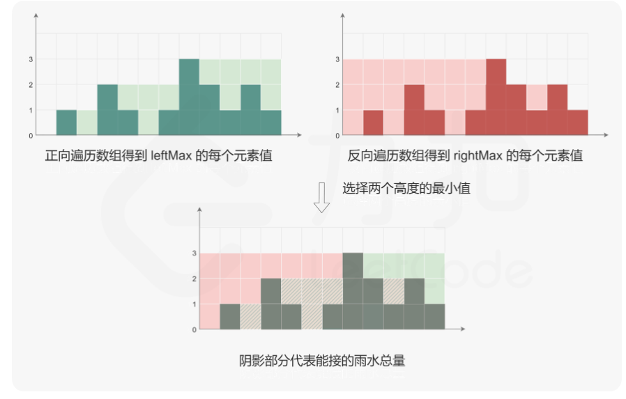

# Leetcode——Hard
## 123. 买卖股票的最佳时机Ⅲ（2023/11/20）
    给定一个数组，它的第 i 个元素是一支给定的股票在第 i 天的价格。
    
    设计一个算法来计算你所能获取的最大利润。你最多可以完成 两笔 交易。
    
    注意：你不能同时参与多笔交易（你必须在再次购买前出售掉之前的股票）。

1. dp: 
    
    5个状态：

    ① 未操作

    ② 买了一次：从①和②来

    ③ 卖了 一次：从②和③来

    ④ 买了两次：从③和④来

    ⑤ 卖了两次：从④和⑤来

## 135. 分发糖果
    n 个孩子站成一排。给你一个整数数组 ratings 表示每个孩子的评分。

    你需要按照以下要求，给这些孩子分发糖果：
    - 每个孩子至少分配到 1 个糖果。
    - 相邻两个孩子评分更高的孩子会获得更多的糖果。
    请你给每个孩子分发糖果，计算并返回需要准备的 最少糖果数目 。
---
    解答：
    1. 从左到右再从右到左，找到每一个点本应所在的最高位置   (O(n)额外空间，O(n)效率);
    2.  从左到右遍历一次，上升区间就正常统计，但是如果一个点开始下降了，则不知道他是在上升区间是最高点还是在下降区间是最高点，所以要先记住上升区间长度，并记住下降区间长度，比较两个长度，来得到他的最高点，并相加。

## 42. 接雨水
    给定 n 个非负整数表示每个宽度为 1 的柱子的高度图，计算按此排列的柱子，下雨之后能接多少雨水。
    
----
    解法：
    1. 双指针：只需要记住最边缘的位置即可。

---
    2. 栈：本质是找左挡板和右挡板，所以只要从递减到递升都会出现水槽，当开始增的时候找到最近的左侧挡板即可，当水槽充满水了就出栈
--- 
    3. 动态规划(算不上可能)：

