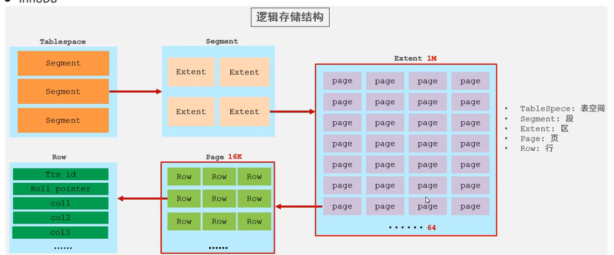
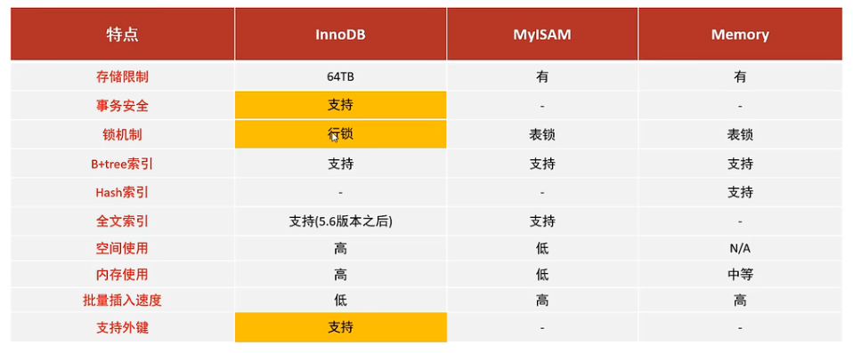

# 存储引擎
## 1. 简介
- 基于表，存储数据，增删改查的实现方法
- 创建表时，用ENGINE = InnoDB
- show engines
## 2.InnoDB引擎
- 兼顾高可靠性和高性能
- 默认应i去那个
- DML操作遵循ACID模型 支持事务
- 行级锁
- 外键
- 每个表xxx都对应一个表空间文件 xxx.ibd,
- 逻辑存储结构： 
## 3.MyISAM
- 早期默认存储引擎
- 不支持事务、外键
- 支持表锁，不支持行锁
- 访问速度快
- xxx.sdi存储表结构 xxx.MYD 存储数据，xxx.MYI存储索引
## 4.Memory
- 存储再内存中
- 速度快
- hash索引
- 只有xxx.sdi文件
## 5. 区别
