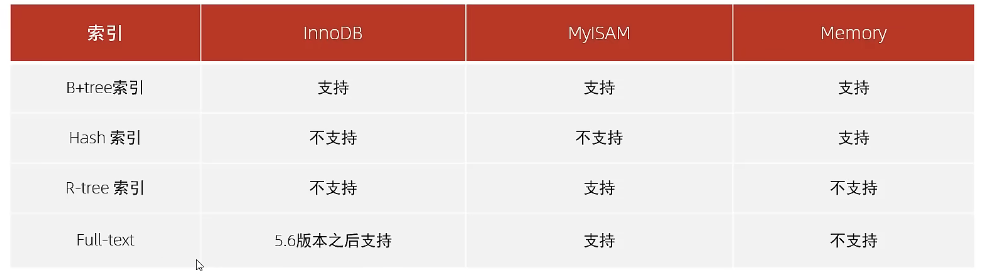

# 索引
## 1.概述
- 高效获取数据的数据结构
- 
## 2.B+ Tree索引
- 度数：一个节点下最多又几个节点
- 所有的元素都会出现再叶子节点
## 3.红黑树
- 自平衡查找树
- 节点是红色和黑色，根节点是黑色，叶子节点是黑色，每个红色节点必须又两个个黑色子节点
- 每条路径上红色不能连续，且黑色数量相同
## 4.B Tree
- 多路平衡查找树

## 5. hash
- 等值匹配，不能范围和排序
- 效率高
- Memory引擎使用
- InooBD可以自适应hash

## 6. MD5
- 不可逆
- 无论输入多少，输出均为128bit
- 高度离散性
- 抗碰撞性
- 补位：1 0 0 0 ，直到长度为N*512+448   剩下64位需要记录原始数据长度
- 标准幻数：4*4 = 16字节 小端


## 7.索引分类
- 主键索引  只能有一个 PRIMARY
- 唯一索引  可以有多个  UNIQUE
- 常规索引  可以有多个  
- 全文索引  可以有多个    FULLTEXT    查找文本关键词
- InnoDB中：
  - 聚集索引：（只能有一个）数据存储和索引放在一起，如果存在主键，主键为聚集索引，没有主键则第一个唯一索引为聚集索引，如果都没有则会自动生成一个rowid来作为隐藏的聚集索引
  - 二级索引：（可以有多个）数据与索引分开存储，存储ID值
  - 回表查询：先在二级索引查找，再去聚集索引中查找

## 8.索引语法
- 创建索引: CREATE [UNIQUE|FULLTEXT] INDEX index_name on table_name
- 删除： DROP index_name on table_name

## 9.SQL性能分析 
- 
```
select gloabl status like 'Com_______'
```
- 慢查询log，记录超过long_query_time的sql语句
- profile详情，看每个语句执行时间
- explain执行计划：再任意SQL语句前加一个explain

## 10. 索引使用
- 最左前缀法则： 最左列开始，并且不跳过索引中的列。>、<会使右侧的列失效
- 在索引上进行运算操作，索引会失效 
- 查询字符串时不加引号，索引会失效
- 模块查询：尾部模糊没事，头部模糊会失效
- or 分开的条件，只有前后都有索引才会用到
- use index(index_name)     建议
- ignore index(index_name)  忽视
- force index(index_name)   强制是使用
- 覆盖索引：查询使用了所以你，列全在索引中找到了
- 前缀索引：提取字符串前一部分 column(n)在列名后加数字