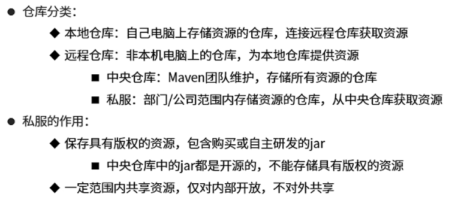
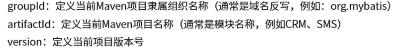
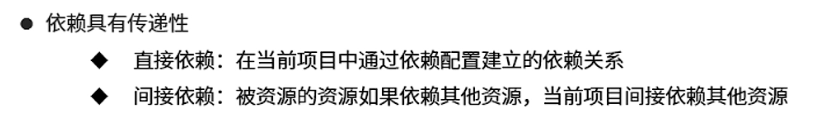
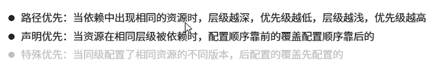
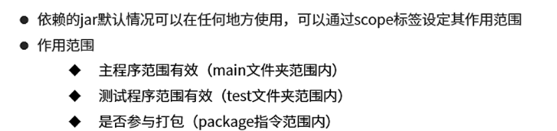

<!--
 * @Descripttion: 
 * @version: 
 * @Author: Caoke
 * @Date: 2023-09-06 13:57:35
 * @LastEditors: Caoke
 * @LastEditTime: 2023-09-06 16:36:35
-->
# Maven基础
Maven的本质是一个项目管理工具，将项目开发和管理过程抽象成一个项目对象模型
- 依赖管理
- 项目构建

POM（Project object Model）：项目对象模型
- 仓库：用于存储资源 各种jar包

- 坐标：Maven中描述仓库中的资源的位置
- 组成：

- 依赖管理

- 依赖管理冲突

- 依赖范围 
