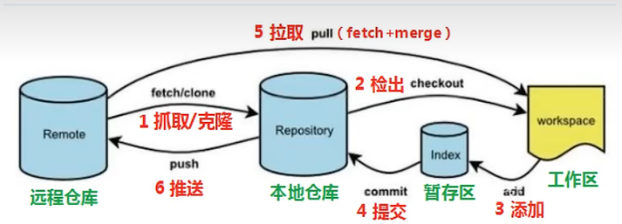
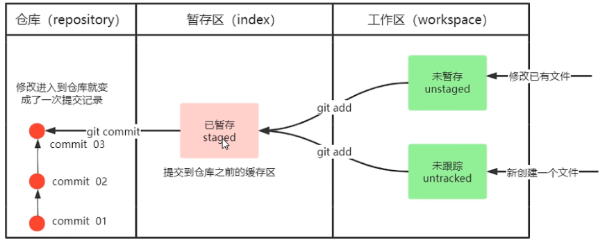
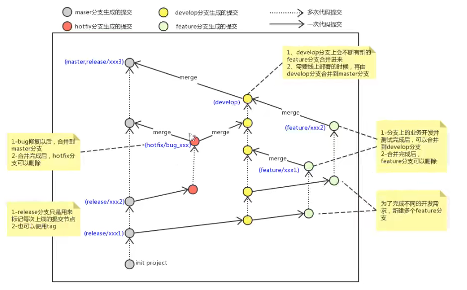

# git
## 简介
- 没有中央版本库，工作时无需联网
## 工作流程

## 获取本地仓库
- git init
## 基础指令操作

- git add： 将工作区workspace未暂存unstaged（修改已有文件）和未跟踪untracked（新创建的文件）的文件，增加到暂存区index，成为已暂存staged
- git commit： index->repository
  - git commit -m "注释"
- git status:查看状态
- git log: 查看日志
  - --all 所有分支
  - --pretty=oneline 所有信息显示一行
  - --abbrev-commit 使commit更加简洁
  - --graph 显示分支
- git reset：版本切换
  - git reset --hard commitID
- git relog:查看删除的版本
## 分支
- git branch:查看分支
- git branch 分支名：创建分支
- git checkout 分支名:切换分支
- git checkout -b 分支名：创建并切换分支
- 规范：
  
  - master生产分支，线上分支，主分支
  - develop开发分支
  - hotfix修复bug
  - feature开发功能
- 删除分支：git branch -d 分支名（会询问） git branch -D 分支名 (强制删除)
## 远程仓库
- ssh-keygen -t rsa -C 邮箱 生成密钥
- ls -al ~/.ssh
- ssh -T git@github.com查看是否生成
- git remote add 仓库名 仓库ssh