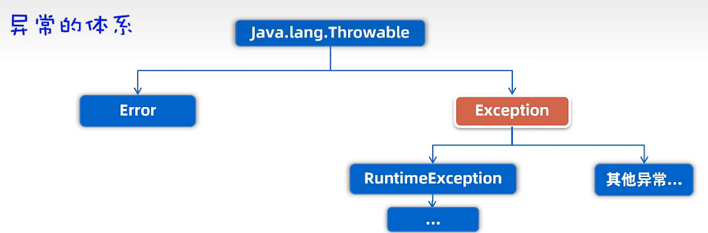

# 异常  
## 1.体系结构  

- Error：系统级别异常。
- Exception：
  - 运行时异常 RuntimeException
  - 编译型异常
## 2. 处理异常
- throws 将方法内部的异常抛给调用者处理
- try、catch    
```java
try
{

} catch(异常类型 变量){

}
```
## 3.自定义异常类
- 运行时异常类：定义类继承RuntimeException


