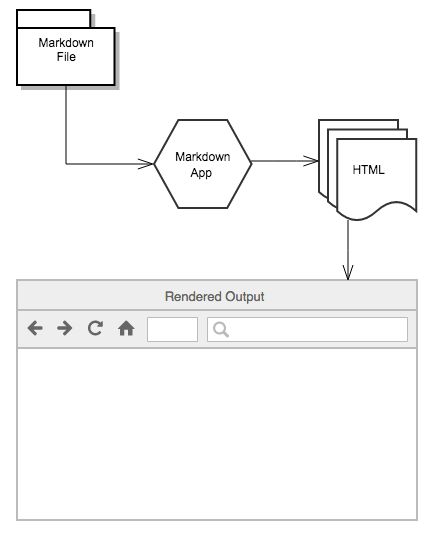

<!--
 * @Descripttion: Markdown学习笔记
 * @Author: Caoke
 * @Date: 2023-06-18 17:06:01
 * @LastEditors: Caoke
 * @LastEditTime: 2023-06-18 19:02:02
-->
# NOTE-Markdown
## 1. 原理
通过将markdown格式的文本转化成HTML，以便可以在web端进行展示。

## 2. 语法
### 基本语法
1.  标题
/**
 * @description: 
 * @return {*}
 */
标题通过'#'符号的多少的多少来区分是几号标题

\# 一号标题

\#\# 二号标题

\#\#\# 三号标题

也可以使用==或者--来表示一号、二号标题

一号标题

\========

二号标题

\--------

2. 强调粗体  
**粗体** \*\*bold**  
*斜体*  \*ltatic*  
三个*可以代表粗体加斜体  
注：*和_可以互换
3. 段落： 中间空一行
4. 换行： 结尾添加**两个**空格  
12345  
5. 引用:  
> 引用的文本需要在开头写入 > 
>
> 引用中包含多个段落可以使用 > 后面什么都没有
>> 多重嵌套使用多个 >
>> - 多种元素的嵌套引用
6. 列表：  
   1. first
   2. second   
      1. 标题的排列与缩进一致
      2. 无论md文件中的标号如何，无序的也会转化成有序的
      3. - 1 \- 1
      4. * 1 \* 1
      5. + 1 \+ 1 
7. 表示代码: 使用\` \`  
`markdown note`
8. 分割线：*** ___ ---
***
___
---
9. 连接：  
[连接名称]（连接内容）:  
[markdown官网](https://markdown.com.cn)  
<直接变成连接>:  
<https://markdown.com.cn>  
可以搭配**bold**和*latic*一同使用  
10. 图片：！\[图片名称](图片地址)  
  
\[！\[图片名称](图片地址)](连接)
[](https://markdown.com.cn)
11. 可以在markdown文件中直接嵌入html  
<table>
    <tr>
        <h1>可以在markdown文件中直接嵌入html</h1>
    </tr>
</table>  

## 拓展语法
1. 表格：  

| Syntax      | Description |
| ----------- | ----------- |
| Header      | Title       |
| Paragraph   | Text        |


使用 ：--- 或 ---： 或：---：代表左侧 右侧 居中
| 1      | 2 | 3     |
| :--- | ---:   | :---:| 
| left | right  |centre|

2. 围栏代码块  
\```写成代码类型可以修改代码颜色  
{
填写代码
    }  
\```
```
{
  "firstName": "John",
  "lastName": "Smith",
  "age": 25
}
```
```json
{
  "firstName": "John",
  "lastName": "Smith",
  "age": 25
}
```


3. 删除线：  
~~删除~~ \~~删除~~

4. 任务列表  
- [x] task1
- [x] task2
- [ ] task3

5. 自动网址链接：  
http://www.example.com

