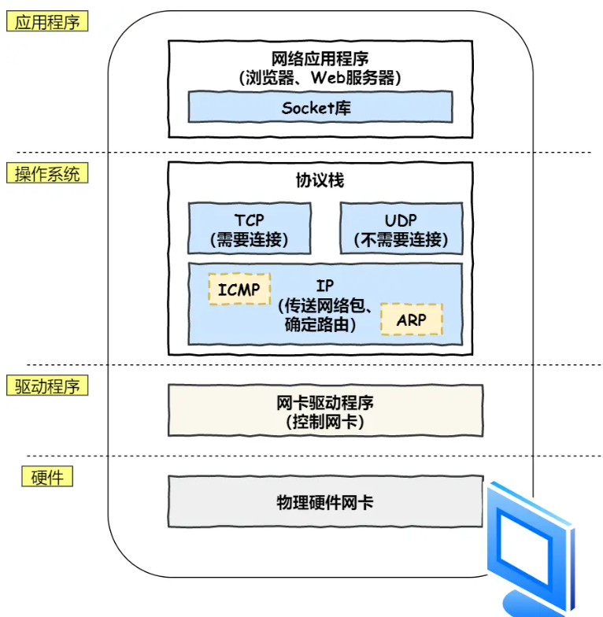
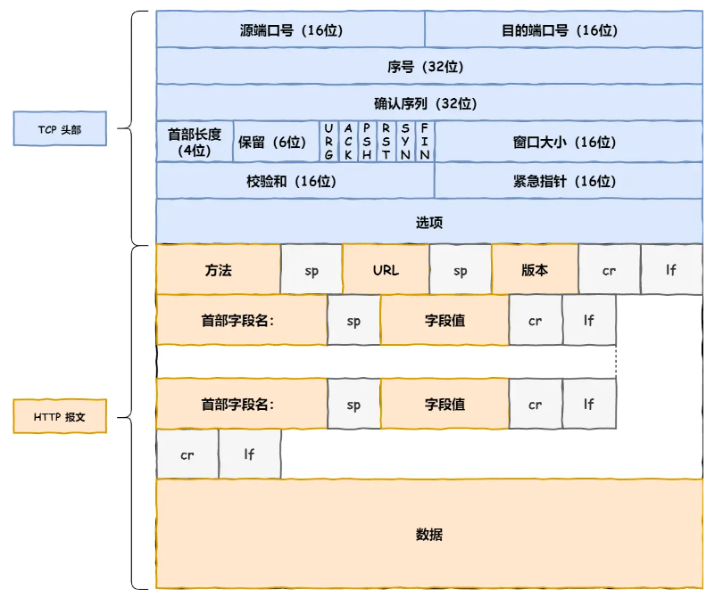
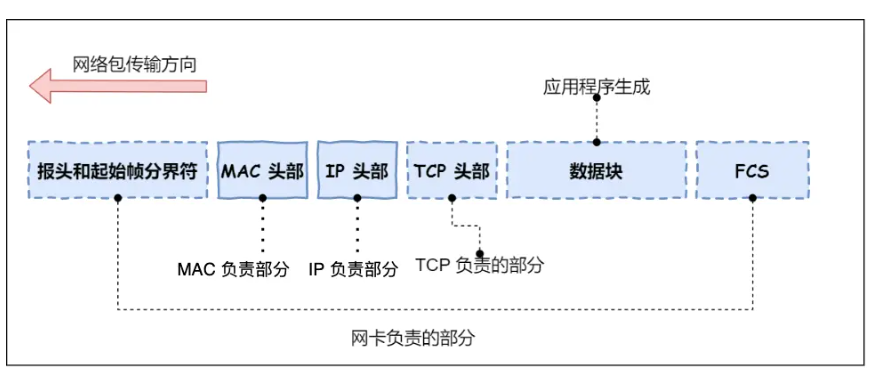

<!--
 * @Descripttion: 
 * @version: 
 * @Author: Caoke
 * @Date: 2023-07-05 17:24:05
 * @LastEditors: Caoke
 * @LastEditTime: 2023-07-05 17:47:55
-->
# 键入网址到网页显示，期间发生了什么？
## 1. HTTP
- 解析URL http://+web服务器+目录 
## 2. DNS
- 真实地址查询，查询Web服务器域名和IP的对应关系  
- 根 DNS 服务器（.）  
顶级域 DNS 服务器（.com）  
权威 DNS 服务器（server.com）  
## 3. 协议栈  ？

## 4. TCP 
### 4.1 报文头部格式  
源端口号、目的端口号、序号（防止包乱序）、确认号、状态位（SYN，ACK，RST重写连接，FIN结束连接）、窗口大小（流量控制）

### 4.2 三次握手
- 客户端发出SYN请求报文，服务器序号1
- 服务端监听，收到SYN请求报文后，返回SYN请求报文，序号为服务器序号100，和ACK应答报文，序号为服务器报+1=2
- 客户端收到之后，发送ACK应答报文，序号为服务器序号+1=101
### 4.3 TCP分割数据
- MTU：一个网络包的最大长度，以太网中一般为 1500 字节。硬件规定
- MSS：TCP包每次传送的最大分段，以太网中一般为 MTU-IPv4header-TCPheader。
### 4.4 TCP报文生成  

## 5.IP-远程定位

## 6.MAC-两点传输
- ARP协议找目标的MAC的地址
- ARP缓存：先查找缓存，如果没有再广播

## 7.网卡-出口
- 数字信息转化成电信号
- 
- 起始帧分界符表示包的其实位置的标记
- FCS帧校验序列检查包传输过程中是否有损坏

## 8.交换机
- 交换机的设计是将网络包原样转发到目的地。交换机工作在 MAC 层，也称为二层网络设备。
- 交换机的端口不具有 MAC 地址
- 广播地址：MAC 地址中的 FF:FF:FF:FF:FF:FF
IP 地址中的 255.255.255.255

## 9.路由器  
