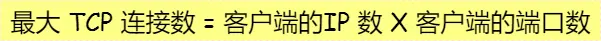
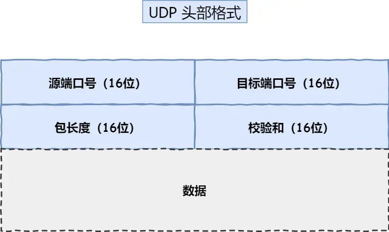
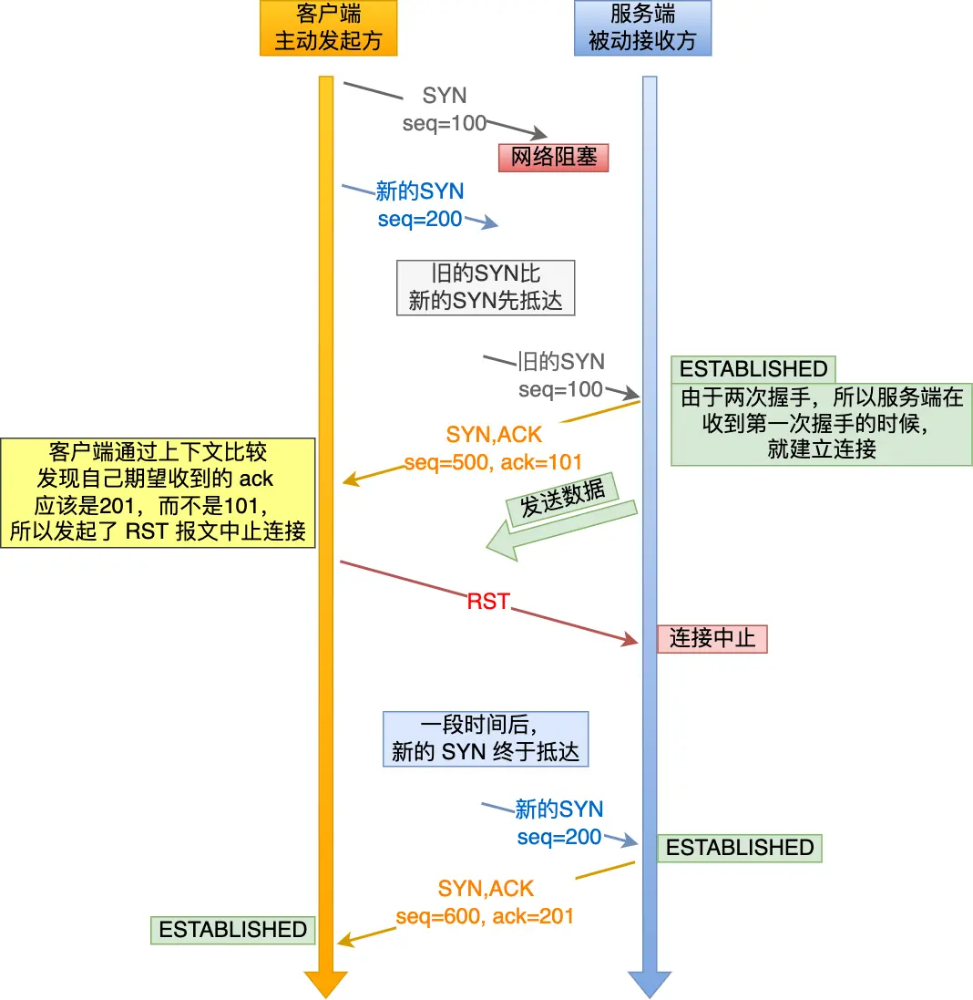

# TCP
- TCP 是面向连接的、可靠的、基于字节流的传输层通信协议。
- TCP 四元组可以唯一的确定一个连接。
- TCP连接：端口号、序列号、窗口大小
- 
- UDP头部格式： 
- 三次握手
  -  第三次握手是可以携带数据的，前两次握手是不可以携带数据的
  -  第二次握手是只发送一个报文，既包含了ACK也有SYN
  -  阻止历史连接，两次握手：
- 序列号作用
  - 接收方可以去除重复的数据
  - 接收方可以根据数据包的序列号按序接收
  - 可以标识发送出去的数据包中， 哪些是已经被对方收到的
- 两次握手的缺点；
  - 服务端会接收无用的SYN报文，历史连接，浪费资源，无法可靠的同步双方序列号
- 为什么每次建立 TCP 连接时，初始化的序列号都要求不一样呢？
  - 为了防止历史报文被下一个相同四元组的连接接收：第一个连接建立后发送报文阻塞了，重新又建立了个连接，但接收了上一个阻塞的报文
  - 为了安全性，防止黑客伪造的相同序列号的 TCP 报文被对方接收
- 初始序列号 ISN 是如何随机产生的？
  - 基于时钟 ISN = M（时钟） + F（源IP，目标IP，源端口，目标端口）的一个hash值
- IP会分层，那为什么需要TCP的MSS?
  - TCP组装不在一起，IP丢了就要全部重传，而TCP分了MSS只需要发送对应的TCP就行
- SYN攻击
  - 客户端发伪造IP的SYN报文，服务端救护i进入SYN-RCVD状态，发送的ACK+SYN埃博问没有应答
  - SYN 攻击方式最直接的表现就会把 TCP 半连接队列打满，这样当 TCP 半连接队列满了，后续再在收到 SYN 报文就会丢弃
- SYN攻击的预防
  - 调大 netdev_max_backlog 当网卡接收数据包的速度大于内核处理的速度时，会有一个队列保存这些数据包。
  - 增大 TCP 半连接队列
  - 开启 net.ipv4.tcp_syncookies
  - 减少 SYN+ACK 重传次数：加快SYN-REVC状态的TCP连接断开
- TCP断开
- TCP四次挥手
  - 
- 为什么四次挥手
  - 因为客户端第一次FIN时，服务端可能还要发东西，所以要等服务端发FIN之后才停止
- 第二次挥手接收不到
  - 此时客户端进入FIN_WAIT_1状态，会重发FIN，超时后关闭
  - 如果发送了ACK之后不发第三次挥手，客户端会进入FIN_WAIT_2状态，超时关闭，如果close关闭则发送接收均关闭，而用shutdown关闭，则只关闭了发送，会死等FIN